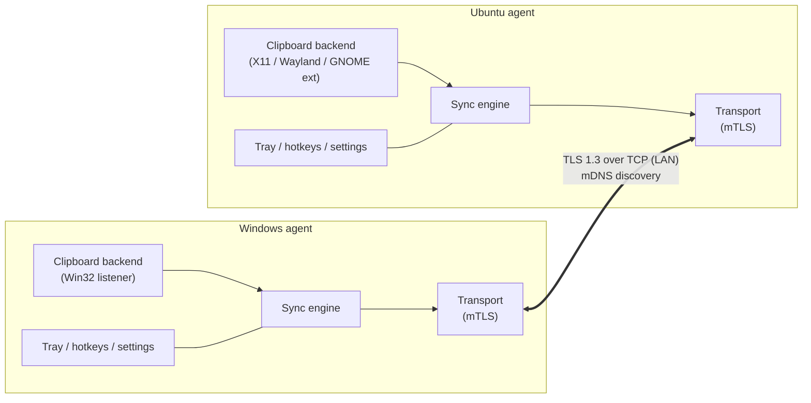
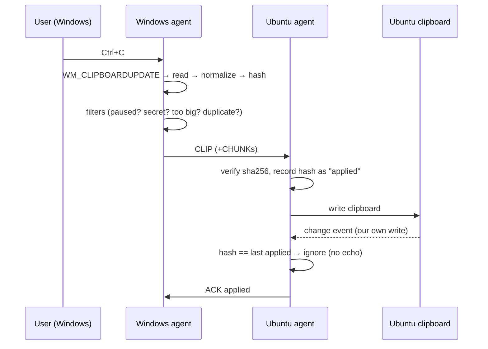

# CrossClip — Design Document

Status: **Draft v0.1** · Scope: Windows ⇄ Ubuntu clipboard sharing

## 1. Problem

I work across two machines (mostly one Windows, one Ubuntu) and constantly move
text, code snippets and screenshots between them. Today that means chat apps,
email-to-self or shared files. The goal is:

> Copy on machine A → paste on machine B, with no extra steps.

## 2. Goals and non-goals

### Goals (v1)
- Sync **plain text / code** (UTF-8) and **images** (screenshots) between paired devices.
- Work on **Windows 10/11** and **Ubuntu 22.04+** (X11 and GNOME Wayland).
- **Automatic** sync on copy, plus a manual "send now" hotkey and a pause toggle.
- **Zero-config on a LAN**: devices find each other automatically.
- **Secure by default**: only explicitly paired devices can exchange data; all traffic is encrypted.
- Runs quietly in the background (tray icon), starts on login, low CPU/memory.

### Later (v2+)
- Rich text / HTML, file and folder copy.
- Clipboard history with search.
- Sync across different networks (via a relay or overlay network).
- More than two devices, macOS.

### Non-goals
- A cloud service that stores clipboard contents.
- Mobile clients (for now).

## 3. How it works (high level)

Each machine runs the same background app (the **agent**). Agents discover each
other on the local network, authenticate with keys exchanged during a one-time
pairing, and keep a persistent encrypted connection open. When the local
clipboard changes, the agent reads it, normalizes it into a portable format and
pushes it to the peer, which writes it into its own clipboard.



## 4. Components

The agent is one process with clearly separated modules. Everything except the
clipboard backend and the UI shell is platform-independent.

| Module | Responsibility |
|---|---|
| **Clipboard backend** | Watch for changes, read and write clipboard formats. One implementation per platform (see §5). |
| **Content model** | Platform-neutral representation of a clip (`ClipItem`). Converts to/from native formats. |
| **Sync engine** | Decides *what* to send and *when*: dedupe, loop prevention, size limits, privacy filters, pause state. |
| **Discovery** | Advertises and browses for peers via mDNS; supports manual `host:port` as a fallback. |
| **Transport** | Mutually authenticated TLS connection with reconnect/backoff; framing and chunking. |
| **Pairing & trust store** | One-time pairing flow; stores peer IDs and certificate fingerprints. |
| **UI shell** | Tray icon, notifications, global hotkeys, settings window, autostart. |
| **Local control API** | Named pipe (Windows) / Unix socket (Linux) for a CLI and, on GNOME Wayland, the shell extension. |

### 4.1 Content model

```text
ClipItem {
  id:          UUIDv7          // time-ordered, unique
  origin:      DeviceId        // who copied it
  created_at:  timestamp
  hash:        SHA-256 of the canonical payload
  kind:        Text | Image | Html | Files     // v1: Text, Image
  payload:
    Text  -> UTF-8 string
    Image -> PNG bytes (+ width, height)
    Html  -> HTML fragment + plain-text fallback              (v2)
    Files -> list of {name, size, sha256}; bytes streamed     (v2)
}
```

**Normalization rules**
- **Text** is always sent as UTF-8. Line endings are sent unchanged (modern
  editors on both OSes handle LF and CRLF); an optional setting can convert them
  to the receiver's native style.
- **Images** are always sent as **PNG**. Windows exposes `CF_DIB`/`CF_DIBV5`
  (and often a registered `PNG` format); Linux exposes `image/png`. The backend
  converts to/from PNG, taking care to preserve alpha from `CF_DIBV5`.
- When a clip carries several formats (e.g. a browser copy with HTML + text),
  v1 syncs the best supported one and always includes plain text if it exists.

## 5. Platform clipboard backends

This is the hardest and most platform-specific part of the project.

### 5.1 Windows
- **Change notification:** `AddClipboardFormatListener` on a hidden message-only
  window → `WM_CLIPBOARDUPDATE`. No polling.
- **Read/write:** `OpenClipboard` / `GetClipboardData` / `SetClipboardData` for
  `CF_UNICODETEXT`, `CF_DIBV5`, registered `PNG`, and later `HTML Format` and `CF_HDROP`.
- **Privacy:** skip clips that contain `ExcludeClipboardContentFromMonitorProcessing`
  or have `CanIncludeInClipboardHistory = 0` — password managers set these.
- `OpenClipboard` can fail while another app holds the clipboard, so reads need a
  short retry loop.

### 5.2 Ubuntu on X11 ("Ubuntu on Xorg")
- **Change notification:** XFixes `SelectSelectionInput` on the `CLIPBOARD` selection.
- **Read:** request `UTF8_STRING` / `text/plain;charset=utf-8` / `image/png` targets.
- **Write:** become the selection owner and serve requests. The agent is a
  long-running process, so clipboard contents stay available after the copy.
- **Privacy:** skip clips that offer the `x-kde-passwordManagerHint` target
  (KeePassXC and others set this).

### 5.3 Ubuntu on Wayland (default since 22.04) — **main technical risk**
Wayland deliberately stops background apps from reading the clipboard.
- Compositors that implement the **data-control** protocol (`wlr-data-control` /
  `ext-data-control`: KDE Plasma, Sway, Hyprland, …) let us watch and set the
  clipboard directly (as `wl-clipboard` does).
- **GNOME (Mutter)**, Ubuntu's default, has historically **not** exposed
  data-control to regular clients. Background watching does not work there, and
  X11 fallbacks via XWayland only see changes when an X11 window has focus.

Options for GNOME Wayland, in order of preference:
1. **GNOME Shell extension (recommended).** A small extension watches
   `Meta.Selection`'s `owner-changed` signal and reads/writes via `St.Clipboard`,
   the same way popular clipboard-manager extensions do. It forwards content to the
   agent over the local control API (Unix socket or D-Bus). This keeps full
   automatic sync on stock Ubuntu.
2. **Use the Xorg session.** Simplest, but asks the user to change their desktop session.
3. **Hotkey-only mode.** A global hotkey briefly focuses a tiny agent window to
   read the clipboard and send it. Works anywhere but loses automatic sync.

The agent picks the backend at runtime from `XDG_SESSION_TYPE`,
`XDG_CURRENT_DESKTOP` and protocol availability. **Milestone 0 must validate this
on the actual Ubuntu version in use** (run `echo $XDG_SESSION_TYPE`).

## 6. Networking

### 6.1 Discovery
- Each agent advertises `_crossclip._tcp.local` via **mDNS/DNS-SD** with TXT
  records `id=<device-id>`, `name=<hostname>`, `v=<protocol-version>`.
- Browsing for peers happens continuously. When a *paired* device appears, connect.
- Fallback: manually configured `host:port` (for networks that block multicast,
  VPNs, or Windows Firewall quirks).
- Default port: **TCP 53317** (configurable). The Windows installer adds a
  firewall rule limited to private networks.

### 6.2 Transport and security
- Each device generates a long-lived **Ed25519 / ECDSA key pair** and a
  self-signed certificate on first run. The certificate fingerprint *is* the
  device identity.
- Connections use **TLS 1.3 with mutual authentication**. Normal CA validation is
  replaced by **certificate pinning**: a peer is accepted only if its fingerprint
  is in the trust store.
- Only one connection per peer pair; the device with the lexicographically
  smaller ID keeps its outgoing connection if both dial at once.
- Heartbeat `PING` every 15 s; reconnect with exponential backoff (1 s → 30 s).

### 6.3 Pairing (one time)
Numeric comparison, as used by Bluetooth:
1. On device A, choose **Pair new device** and pick B from the discovered list
   (or enter an IP address).
2. A and B open a temporary TLS connection **without** pinning and exchange certificates.
3. Both show a **6-digit code** derived from `SHA-256(certA ‖ certB)` (sorted).
4. The user checks that both screens show the same code and clicks **Confirm** on both.
5. Each side stores the other's fingerprint and name. Later connections are fully pinned.

A man-in-the-middle would produce different codes on the two screens, so the
user's comparison is what makes pairing secure. No shared secret has to be typed.

### 6.4 Wire protocol
Length-prefixed frames on the TLS stream:

```text
frame := u32 frame_len (BE) | u16 header_len (BE) | header (JSON) | body (bytes)
```

| Type | Direction | Header fields | Body |
|---|---|---|---|
| `HELLO` | both | `device_id`, `name`, `proto_version`, `capabilities[]` | – |
| `CLIP` | sender → receiver | `id`, `origin`, `kind`, `mime`, `size`, `sha256`, `created_at`, `chunks` | first chunk |
| `CHUNK` | sender → receiver | `id`, `index` | ≤ 1 MiB of payload |
| `ACK` | receiver → sender | `id`, `status` (`applied` / `rejected:<reason>`) | – |
| `PING` / `PONG` | both | `ts` | – |

- Payloads over 1 MiB are split into chunks. The receiver checks `sha256` before
  touching the clipboard.
- Default maximum clip size: **50 MiB** (configurable). Bigger items are refused
  with a notification.
- `proto_version` + `capabilities` allow later features (HTML, files, lazy
  transfer) without breaking older agents.

## 7. Sync engine behaviour



- **Loop prevention:** after writing a remote clip, the agent stores its hash. A
  local change event with the same hash is ignored. Windows backends also add a
  private marker format to the clipboard as a second check.
- **Debounce:** some apps update the clipboard several times in a row (for
  example delayed rendering or multiple formats). Wait about 150 ms after the
  last change before reading.
- **Dedupe:** do not resend a clip whose hash matches the last one sent.
- **Conflicts:** last writer wins by `created_at`, with `device_id` as tie-breaker.
  With two devices and human-speed copying this rarely matters.
- **Modes:** `auto` (default), `manual` (only the hotkey sends), `receive-only`, `paused`.
- **Filters:** secret or password-manager hints (§5), max size, and an optional
  app blocklist on Windows (via `GetClipboardOwner` → process name).

## 8. User experience

- **Tray icon** showing state (connected / disconnected / paused) with a menu:
  Pause, Send now, Paired devices, Settings, Quit.
- **Hotkeys** (configurable): `Ctrl+Alt+C` to send now, `Ctrl+Alt+P` to pause or resume.
- **Notification** when a clip arrives (optional, off by default for text).
- **Autostart:** Windows `Run` registry key or a Startup shortcut; Linux
  `~/.config/autostart/crossclip.desktop` (or a systemd user service).
- **Config:** TOML at `%APPDATA%\CrossClip\config.toml` and
  `~/.config/crossclip/config.toml`. Trust store and keys live next to it.
- **CLI** (for scripts): `crossclip status`, `crossclip pair`, `crossclip send < file.txt`,
  `crossclip send --image shot.png`.

## 9. Technology choice

| Option | Pros | Cons |
|---|---|---|
| **Rust** (recommended) | Single small native binary, low memory, strong cross-platform crates (`arboard`, `tokio`, `rustls`, `mdns-sd`, `tray-icon`, `global-hotkey`, `image`), safe concurrency | Slower to prototype; learning curve |
| Go | Simple, fast to write, easy cross-compilation for networking | Clipboard libraries need cgo on Linux and have weaker image and Wayland support; tray and hotkey libraries are less mature |
| Python | Fastest prototype (`pyperclip`, `Pillow`, `zeroconf`) | Distribution (PyInstaller) is clunky, and native clipboard watching still needs per-OS code |
| Electron / Tauri | Nice UI | Heavy (Electron); clipboard *watching* still needs native code |

**Recommendation: Rust**, with a Cargo workspace. A quick Python spike is fine for
Milestone 0 if it helps validate the platform clipboard behaviour faster.

Suggested crates:
- Async and networking: `tokio`, `tokio-rustls`, `rustls`, `rcgen` (self-signed certs), `mdns-sd`
- Clipboard: `arboard` for read/write (text and images on Windows, X11 and Wayland data-control) plus our own change watchers (`windows` crate, `x11rb` XFixes, `wayland-client`)
- Images: `image` / `png`
- UI: `tray-icon`, `muda` (menus), `global-hotkey`, `notify-rust`
- Misc: `serde`, `serde_json`, `toml`, `uuid`, `sha2`, `tracing`, `directories`

### Proposed repository layout

```text
Cross-copy-clipboard/
├── Cargo.toml                  # workspace
├── crates/
│   ├── crossclip-core/         # ClipItem, protocol frames, sync engine (no OS code)
│   ├── crossclip-clipboard/    # Backend trait + windows / x11 / wayland / gnome-bridge
│   ├── crossclip-net/          # discovery, TLS transport, pairing, trust store
│   └── crossclip-agent/        # binary: tray, hotkeys, config, CLI, wiring
├── gnome-extension/            # GNOME Shell extension (Wayland bridge)
├── packaging/                  # MSI/installer (Windows), .deb (Ubuntu)
└── docs/
    └── DESIGN.md
```

Key abstraction:

```rust
#[async_trait]
pub trait ClipboardBackend: Send + Sync {
    /// Stream of "clipboard changed" events (debounced by the engine).
    fn watch(&self) -> BoxStream<'static, ()>;
    /// Read the current clipboard in the best supported normalized format.
    async fn read(&self) -> Result<Option<ClipContent>>;
    /// Replace the clipboard contents.
    async fn write(&self, content: &ClipContent) -> Result<()>;
}
```

## 10. Milestones

| # | Milestone | Outcome |
|---|---|---|
| **M0** | Platform spike | Small programs that *watch*, *read* and *write* text and images on Windows, Ubuntu X11 and Ubuntu GNOME Wayland. Confirms the Wayland approach. |
| **M1** | Text sync MVP | Two agents, manual IP, mutual TLS with pinned fingerprints, text sync with loop prevention. Run from a terminal. |
| **M2** | Images + discovery + pairing | PNG images, chunking, mDNS discovery, numeric-comparison pairing. |
| **M3** | Daily-driver polish | Tray, hotkeys, notifications, autostart, config file, privacy filters, installers (.msi / .deb). |
| **M4** | Extras | HTML and rich text, files, history, lazy transfer for large items, relay or overlay-network support. |

## 11. Risks and open questions

| Risk / question | Mitigation |
|---|---|
| GNOME Wayland blocks background clipboard access | GNOME Shell extension bridge (§5.3); Xorg session or hotkey mode as fallback. Validate in M0. |
| Machines on different networks (home vs office) | v1 supports manual host:port. Recommend an overlay VPN (for example Tailscale or ZeroTier) instead of building a relay; revisit later. |
| Corporate or Windows firewall blocks the port or mDNS | Installer firewall rule, manual peer address, clear diagnostics in `crossclip status`. |
| Syncing secrets accidentally | Honour password-manager hints, pause hotkey, optional app blocklist, nothing ever stored on disk by default. |
| Large or odd clipboard formats (Office, image editors) | Size cap; v1 falls back to text or PNG only. |

## 12. Alternatives considered

- **Existing tools** — Barrier / Input Leap and Synergy (keyboard and mouse
  sharing with clipboard sync), KDE Connect / GSConnect, LocalSend (file-focused).
  They are reasonable choices, but they bring features we don't need (input
  sharing), have weak image support on Wayland, or are not built around
  automatic clipboard sync. Building our own keeps the tool small and focused,
  and lets us own the Wayland story.
- **Cloud relay** (both agents talk to a server) — works across networks but
  adds hosting, latency and a privacy surface. Deferred; an overlay VPN gives
  the same reach with our LAN protocol unchanged.
- **Polling the clipboard** instead of events — simpler but wasteful and laggy;
  used only as a last-resort backend.
