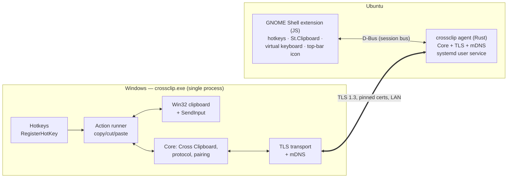
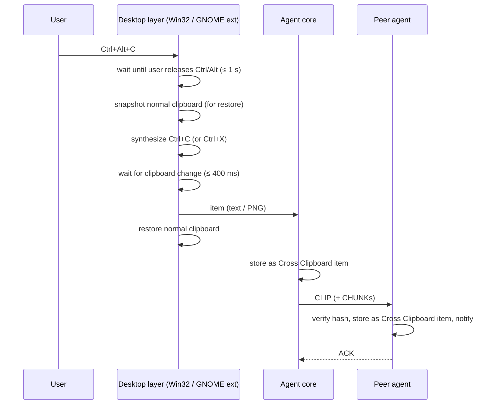

# CrossClip — Design Document

Status: **Draft v0.2** · Scope: Windows 10/11 ⇄ Ubuntu 26.04 LTS (GNOME, Wayland)

Changes since v0.1: the design moved from "mirror the normal clipboard
automatically" to a **separate, hotkey-driven Cross Clipboard**. On Ubuntu, a
GNOME Shell extension now handles the hotkeys, clipboard access and keystrokes,
and there is no X11 fallback. We also set a strict resource and dependency budget.

## 1. Problem

I work across two machines on the same network, one Windows and one Ubuntu, and
often need to copy or cut something (text, code, a screenshot) on one and paste
it on the other. Today that means chat apps, email-to-self or shared files.

## 2. Requirements

| # | Requirement |
|---|---|
| R1 | Move **text/code** and **images** from one machine to the other. |
| R2 | Triggered only by **dedicated shortcuts**. Normal `Ctrl+C` / `Ctrl+V` keep working exactly as today. |
| R3 | After the shortcut, transfer is **automatic**. There is nothing to click on either machine. |
| R4 | **Windows 10/11** and **Ubuntu 26.04 LTS on Wayland** (GNOME). |
| R5 | Same LAN, zero configuration after a one-time pairing. |
| R6 | Encrypted; only paired devices can exchange data. |
| R7 | **Very light background load** (≈0 % CPU when idle, low memory), and **no extra software to install** (no Python, runtimes, OpenSSL, Avahi, etc.). |

Later (v2+): files, rich text/HTML, history, more than two devices, working across networks.

## 3. User experience

### 3.1 The Cross Clipboard

CrossClip adds a **second clipboard** that is shared between the two machines.
It holds one item (the latest). Your normal clipboard stays separate from it.

| Shortcut (default, configurable) | What it does |
|---|---|
| **`Ctrl+Alt+C`** — Cross-copy | Copies the current selection into the Cross Clipboard and sends it to the other machine at once. |
| **`Ctrl+Alt+X`** — Cross-cut | Same, but cuts the selection. |
| **`Ctrl+Alt+V`** — Cross-paste | Pastes the Cross Clipboard item into the focused app. Works on **either** machine. |

Example: select code in VS Code on Windows → `Ctrl+Alt+C` → switch to Ubuntu →
`Ctrl+Alt+V` in the editor. A small notification ("Received: 42 lines of text" /
"Received: image 1920×1080") confirms arrival.

**Screenshots:** take a screenshot to the clipboard as usual (`Win+Shift+S`,
`PrtSc` on Ubuntu), then press `Ctrl+Alt+C`. If the copy keystroke doesn't
change the clipboard (nothing selected), CrossClip sends whatever is already on
the normal clipboard. See §5.3 for an editor edge case.

### 3.2 The normal clipboard is left alone

Under the hood, cross-copy and cross-paste use the system clipboard for a moment,
because that is how apps exchange data. CrossClip **saves the normal clipboard
before the action and restores it afterwards** (default on). So `Ctrl+V` still
pastes what you last copied with `Ctrl+C`.

- Restore is *best effort*: text, images, HTML and other data-based formats are
  restored. Very large or unusual formats (for example a huge Excel range) are
  skipped when they exceed a size limit.
- Temporary writes are hidden from Windows clipboard history (`Win+V`) with the
  `ExcludeClipboardContentFromMonitorProcessing` and
  `CanIncludeInClipboardHistory=0` formats.
- Setting `also_set_normal_clipboard = true` makes received items **also** land on the
  receiving machine's normal clipboard, for people who prefer plain `Ctrl+V`.

### 3.3 Other UX details
- If the other machine is offline, the item is queued and delivered when it
  reconnects. Only the latest item is kept.
- If you press `Ctrl+Alt+V` while a large item is still arriving, the paste waits
  (up to 10 s) with a "Receiving…" notification.
- **Status indicator:** tray icon on Windows, top-bar icon on GNOME. It shows
  connected / disconnected and offers a menu with Pair device, Settings, Pause and Quit.

## 4. Architecture



The **core** (Cross Clipboard state, wire protocol, pairing, trust store,
transport, discovery) is shared Rust code. Only the "desktop integration"
differs:

- **Windows:** everything runs in one Rust executable.
- **Ubuntu (GNOME Wayland):** Wayland does not let ordinary background apps grab
  global hotkeys, read the clipboard or send keystrokes. **GNOME Shell
  extensions can do all three**, so a small extension handles the desktop side
  and talks to the Rust agent over D-Bus. The agent handles networking and crypto.

### Why the extension approach is right for Ubuntu 26.04
- GNOME 49+ has removed the X11 session, so there is no Xorg fallback anymore.
- The hotkey-driven model needs exactly three desktop capabilities: a global
  shortcut, clipboard read/write and a synthetic keystroke. An extension gets all
  three from supported Shell APIs: `Main.wm.addKeybinding`, `St.Clipboard` and a
  Clutter virtual input device.
- No clipboard *watching* is needed, which avoids the hardest Wayland limitation.
- The extension stays thin (a few hundred lines of JS). All logic that could
  have bugs, such as protocol and crypto, lives in Rust and is shared with Windows.

## 5. Action flows

### 5.1 Cross-copy / cross-cut



### 5.2 Cross-paste

1. Wait for modifier release, then snapshot the normal clipboard.
2. Write the Cross Clipboard item to the system clipboard (hidden from history on Windows).
3. Synthesize `Ctrl+V`.
4. After about 500 ms, restore the normal clipboard. The delay is needed because
   the target app reads the clipboard asynchronously; it is configurable.

### 5.3 Details that matter

- **Held modifiers:** the hotkey fires while the user still holds `Ctrl+Alt`. If we
  sent `Ctrl+C` at that moment, the app would see `Ctrl+Alt+C`. The desktop layer
  waits until the physical modifiers are released: `GetAsyncKeyState` on Windows,
  the modifier mask from `global.get_pointer()` on GNOME. If the user keeps
  holding them, it releases them synthetically after 1 s.
- **Terminals:** in a terminal `Ctrl+C` interrupts the running program. On GNOME,
  the extension checks the focused window's `wm_class` (Ptyxis, GNOME Terminal,
  Kitty, Alacritty, …) and uses `Ctrl+Shift+C/V` there instead. The list is
  configurable. Windows Terminal handles `Ctrl+C`/`Ctrl+V` correctly when text is
  selected; classic `conhost` gets the same per-app override.
- **Nothing selected:** most apps leave the clipboard unchanged. Then we send the
  current normal clipboard (covers the screenshot case). Some editors, for example
  VS Code, copy the *current line* when nothing is selected. That is expected
  editor behaviour and is documented.
- **Elevated windows (Windows):** a normal process cannot send keystrokes to an
  app running as Administrator. We show a notification ("Can't paste into an
  elevated window") instead of failing silently.
- **Detecting the change:** Windows compares `GetClipboardSequenceNumber()`
  before and after. GNOME listens to `Meta.Selection` `owner-changed`.

## 6. Components

### 6.1 Core (shared Rust)
| Module | Responsibility |
|---|---|
| `model` | `ClipItem { id: UUIDv7, origin, created_at, sha256, kind: Text\|Image, payload }`. Text is UTF-8 sent unchanged. Images are always PNG on the wire. |
| `state` | The single Cross Clipboard slot, the outgoing queue for an offline peer, last-writer-wins by `created_at` (device id as tie-breaker). |
| `proto` | Frame encoding and decoding (§7.4). |
| `net` | TLS 1.3 transport, reconnect with backoff, heartbeats. |
| `discovery` | mDNS advertise and browse, plus a manual `host:port` fallback. |
| `pairing` / `trust` | One-time pairing and the pinned-fingerprint trust store. |
| `config` | TOML config, hotkeys, limits, the terminal/app override list. |

### 6.2 Windows desktop layer (Rust, same binary)
- A hidden message-only window receives `WM_HOTKEY` (via `RegisterHotKey`).
  No keyboard hook and no polling.
- Clipboard: Win32 `OpenClipboard`/`GetClipboardData`/`SetClipboardData` for
  `CF_UNICODETEXT`, `PNG`/`CF_DIBV5`. `OpenClipboard` is retried briefly when
  another app holds the clipboard. Snapshot and restore enumerate all
  memory-backed formats.
- Keystrokes: `SendInput`.
- Images: DIB ⇄ PNG conversion, preserving alpha from `CF_DIBV5`.
- Tray icon and menu; notifications via Windows toast.
- Autostart: `HKCU\...\Run` entry. **No admin rights needed.**

### 6.3 GNOME Shell extension (JavaScript, ESM, GNOME 49/50)
- Registers the three keybindings from its GSettings schema.
- Reads and writes the clipboard with `St.Clipboard.get_content` / `set_content`
  (`text/plain;charset=utf-8`, `image/png`). Snapshot and restore use
  `get_mimetypes()` followed by per-type reads.
- Synthesizes keys through `Clutter` virtual keyboard device.
- Top-bar indicator, notifications (`Main.notify`) and the pairing confirmation dialog.
- Talks to the agent over the D-Bus session bus (§6.4).

### 6.4 Ubuntu agent (Rust) and its D-Bus interface
The agent is the same core as on Windows, built without the Win32 layer. It runs
as a **systemd user service** (`~/.config/systemd/user/crossclip.service`), so it
starts on login and restarts if it crashes, without root.

Bus name `io.github.eklavya99.CrossClip`, object `/io/github/eklavya99/CrossClip`:

| Member | Kind | Purpose |
|---|---|---|
| `Push(kind s, mime s, path s)` | method | Extension hands a new Cross Clipboard item to the agent. |
| `Fetch() → (kind s, mime s, path s)` | method | Extension gets the current item for pasting. |
| `ItemReceived(kind s, summary s)` | signal | Peer sent something; used for the notification. |
| `StatusChanged(state s, peer s)` | signal | Connected / disconnected / pairing. |
| `StartPairing()`, `ConfirmPairing(code s, accept b)` | method / signal | Pairing UI lives in the extension. |

Payloads are passed as files in `$XDG_RUNTIME_DIR/crossclip/`, which is a
per-user tmpfs with mode 0700 and never touches disk. Only the paths go over
D-Bus, so large images never hit D-Bus message size limits.

## 7. Networking

### 7.1 Discovery
- mDNS/DNS-SD service `_crossclip._tcp.local` with TXT records `id`, `name`
  and `v` (protocol version). A pure-Rust implementation is used, so Avahi and
  Bonjour are not needed.
- A manual `host:port` in the config works when multicast is blocked (for
  example on corporate Wi-Fi).
- Default port **TCP 53317**. On first run Windows shows its standard firewall
  prompt; choose **Private networks**.

### 7.2 Transport security
- On first run each device creates a key pair and a self-signed certificate. Its
  fingerprint is the device ID.
- Connections use **TLS 1.3 with mutual authentication and pinned
  fingerprints**: only certificates in the trust store are accepted.
- There is one connection per peer (the lower device ID wins a dial race). A
  heartbeat is sent every 30 s, and reconnects use backoff from 1 s to 30 s.

### 7.3 Pairing (one time, numeric comparison)
1. On one machine, choose **Pair device** and pick the other machine from the
   discovered list (or type its IP).
2. The machines connect without pinning and exchange certificates.
3. Both show a **6-digit code** derived from `SHA-256(sorted(certA, certB))`.
4. Confirm on both machines that the codes match. The fingerprints are stored,
   and from then on all connections are pinned.

### 7.4 Wire protocol
```text
frame := u32 frame_len (BE) | u16 header_len (BE) | header (JSON) | body (bytes)
```
| Type | Header fields | Body |
|---|---|---|
| `HELLO` | `device_id`, `name`, `proto_version`, `capabilities[]` | – |
| `CLIP` | `id`, `origin`, `kind`, `mime`, `size`, `sha256`, `created_at`, `chunks` | first chunk |
| `CHUNK` | `id`, `index` | ≤ 1 MiB |
| `ACK` | `id`, `status` | – |
| `PING` / `PONG` | `ts` | – |

The receiver verifies `sha256` before storing an item. Items are limited to
**50 MiB** by default. `proto_version` and `capabilities` let later versions add
files and HTML without breaking older agents.

## 8. Resource and dependency budget

| Budget | Target | How |
|---|---|---|
| Idle CPU | ~0 % (no polling, no timers except a 30 s heartbeat) | Event-driven only: `WM_HOTKEY`, D-Bus calls, socket readiness. Single-threaded `tokio` runtime. |
| Idle memory | < 10 MB RSS (Windows exe / Linux agent) | No GUI toolkit; the item is freed once replaced. The extension adds negligible memory inside GNOME Shell. |
| Binary size | ~3–6 MB, stripped with LTO | `rustls` instead of OpenSSL; no async-std/GUI frameworks. |
| **Runtime installs** | **None** | Windows: one `crossclip.exe`. Ubuntu: one `crossclip` binary, one extension folder and one systemd unit, all in `~/.local`/`~/.config`. No `apt install` and no root. |
| Build tools (developer only) | Rust toolchain | Cross-compile Windows from Linux with `cargo-xwin`, or build natively on each OS. |

Planned crates (all pure Rust, no system libraries):
`tokio` (rt, net, time), `rustls` + `tokio-rustls`, `rcgen`, `mdns-sd`,
`serde`/`serde_json`, `toml`, `sha2`, `uuid`, `directories`, `tracing`.
Windows only: `windows` (Win32 bindings), `png`, `tray-icon`.
Linux only: `zbus` (pure-Rust D-Bus; no libdbus).

## 9. Repository layout

```text
Cross-copy-clipboard/
├── Cargo.toml                   # workspace
├── crates/
│   ├── crossclip-core/          # model, state, proto, net, discovery, pairing, config
│   ├── crossclip-win/           # Win32 hotkeys, clipboard, SendInput, tray (cfg(windows))
│   ├── crossclip-dbus/          # D-Bus service for the GNOME extension (cfg(linux))
│   └── crossclip/               # the binary: wires core + platform layer, CLI
├── gnome-extension/
│   └── crossclip@eklavya99.github.io/
│       ├── metadata.json
│       ├── extension.js
│       ├── prefs.js
│       └── schemas/
├── packaging/
│   ├── install-ubuntu.sh        # copies binary, unit, extension; enables them
│   └── windows/                 # optional installer later
└── docs/DESIGN.md
```

## 10. Milestones

| # | Milestone | Done when |
|---|---|---|
| **M0** | Desktop spike | Windows: hotkey → synthetic `Ctrl+C` → read text/image → restore. Ubuntu 26.04: the extension does the same and prints the result. Both paths verified by hand. |
| **M1** | Text end-to-end | Two agents with a manual peer address, TLS with fingerprints exchanged manually, `Ctrl+Alt+C` / `Ctrl+Alt+V` moves text in both directions. |
| **M2** | Images + discovery + pairing | PNG images with chunking, mDNS, numeric-comparison pairing UI on both sides. |
| **M3** | Daily driver | Clipboard restore, cross-cut, terminal overrides, offline queue, notifications, tray/top-bar status, autostart, `install-ubuntu.sh`, release builds. |
| **M4** | Extras | Files, HTML, history, optional overlay-VPN notes for other networks. |

## 11. Risks and open questions

| Risk | Mitigation |
|---|---|
| GNOME Shell extension API changes between GNOME versions | Keep the extension tiny; declare supported `shell-version`s; re-test on each Ubuntu release. |
| New extensions need a logout/login on Wayland before they load | Installer tells the user to log out once. This is only needed at install or upgrade. |
| Timing of synthetic keystrokes in slow apps | Configurable delays (`copy_wait_ms`, `restore_delay_ms`) and per-app overrides. |
| `Ctrl+Alt` acts as AltGr on some keyboard layouts (e.g. Polish) | All shortcuts are configurable. |
| Clipboard-history extensions on GNOME may record the temporary writes | Documented; restore limits the effect. |
| Unsigned `.exe` triggers SmartScreen on first run | Documented; code signing later if needed. |

## 12. Alternatives considered

- **Mirror the normal clipboard automatically** (v0.1 design). Rejected: the user
  wants explicit shortcuts, and on GNOME Wayland background clipboard watching is
  the hardest part to get working.
- **Portals (`GlobalShortcuts` + `RemoteDesktop` for keystrokes) instead of an
  extension.** This avoids the extension, but the RemoteDesktop portal asks the
  user for permission and shows a "screen is being controlled" indicator, and
  there is still no clipboard read without focus. Rejected in favour of the extension.
- **Do everything in the GNOME extension (including networking).** GJS has no
  mDNS, and the protocol and crypto would be duplicated in JS. Rejected.
- **Existing tools** (Input Leap/Barrier, KDE Connect/GSConnect, LocalSend). They
  either sync the normal clipboard automatically, focus on files, or add features
  we don't need.
